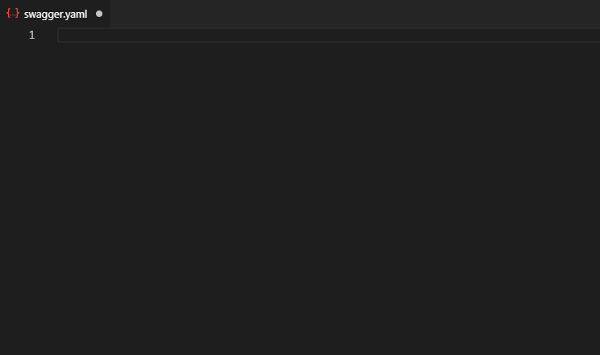

# Swagger Snippets

VSCode Snippets for writin OAS 3.0 compliant code snippets in YAML.

## See it in action

## How to Install

1. Open **Extensions** sidebar panel in Visual Studio Code. `View → Extensions`
1. Search for `Swagger Snippets`
1. Click **Install**
1. When in YAML file just type in `swa` and you can see the snippet suggestions.

**Note** If suggestions are not showing try pressing `Ctlr + Space`

**Enjoy!**
